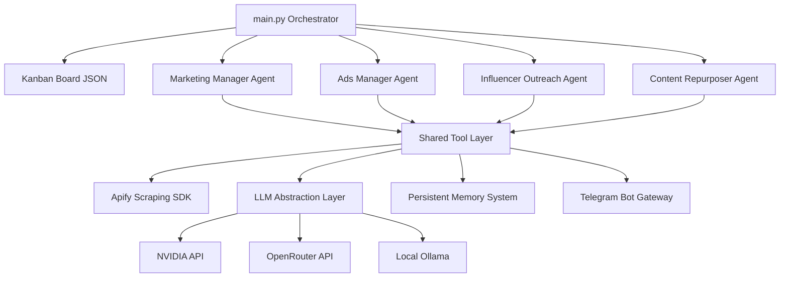

# Autonomous Multi-Agent Marketing & Intelligence Pipeline

[](https://github.com/Mat-rixMJ/Agent-collector/actions/workflows/ci.yml)
[](https://opensource.org/licenses/MIT)
[](https://www.python.org/downloads/)

An autonomous, multi-agent intelligence and campaign distribution engine designed to execute end-to-end competitive research, Meta ad library scraping, script writing, video scoring, cold outreach, and multi-format content distribution.

---

## ⚡ See It in Action (No Setup Required)

### 📄 Sample Reports (AI-Generated, Production Quality)

| Report | Target | What's inside |
|--------|--------|---------------|
| **[Cult.fit Marketing Report](sample_reports/Cultfit_Marketing_Report_Clean.pdf)** | Indian fitness market | 5 competitors analyzed, 206 Meta ads scraped, 15 influencers discovered, A/B test plan, content calendar |
| **[CrowdWisdomTrading Report](sample_reports/CrowdWisdomTrading_Marketing_Report_Clean.pdf)** | Retail trading education | 5 competitors with pricing, 235 ads analyzed, 73 YouTube creators, 3 ad script variants scored |

> *These reports were generated end-to-end by the pipeline with zero manual editing. Hallucinated data is flagged with [VERIFICATION NEEDED] placeholders rather than published.*

---

* **Live Interactive Dashboard:** [View Live Streamlit Dashboard](https://marketing-agents-dashboard.streamlit.app) *(Visualizes the current Kanban states, scorecard, competitor comparisons, and outreach drafts in your browser).*
* **Zero-Setup Sample Outputs:** Explore the raw agent outputs produced in a full pipeline run:
  * 📋 [Visual Kanban Task Board](sample_output/kanban/board.json)
  * 📈 [Competitor Intelligence Briefs](sample_output/obsidian_vault/Competitors/) & [Strategy Brief](sample_output/obsidian_vault/Strategy/brief.md)
  * 🎬 [Ad Script Scorecard](sample_output/obsidian_vault/Ads/_scorecard.md) & [Generated Script Variants](sample_output/obsidian_vault/Ads/)
  * ✉️ [Influencer Discovery & Outreach Drafts](sample_output/obsidian_vault/Outreach/)
  * 📅 [Social Media Content Calendar](sample_output/obsidian_vault/Content/_calendar.md)
  * 📄 [Generated PDF Executive Report](sample_reports/Cultfit_Marketing_Report_Clean.pdf)

---

## 📸 Demo Walkthrough

### Terminal Execution

```bash
$ python main.py --fresh

==================================================
MARKETING INTELLIGENCE AGENTS
==================================================
Select run mode:
  1. Fresh start (wipe all data, run from scratch)
  2. Incremental (use memory, skip already-processed items)

[FRESH START] All previous data cleared.

──────────────────────────────────────────────────
PIPELINE RUNNING
──────────────────────────────────────────────────

┌─ Agent 1/4: Marketing Manager
│  Card: Competitor research: top 5 competitors
│  Status: Backlog → In Progress
  [1/2] Competitor research... ✓
  [2/2] Generate strategy brief... ✓
└─ Status: In Progress → Review ✓

┌─ Agent 2/4: Ads Manager
│  Card: Scrape Meta Ads Library — last 30 days
│  Status: Backlog → In Progress
  [1/5] Scrape Meta ads... ✓  (274 ads, 11 shortlisted)
  [2/5] Extract ad concepts... ✓  (11 concepts)
  [3/5] Generate ad scripts (3 variants)... ✓
  [4/5] Score ad scripts... ✓  (Top: 39/50)
  [5/5] Auto-revise weak scripts... ✓
└─ Status: In Progress → Review ✓

┌─ Agent 3/4: Influencer Outreach
│  Card: Find influencers in target niche
│  Status: Backlog → In Progress
  [1/2] Find influencers... ✓  (68 channels)
  [2/2] Draft outreach... ✓  (15 drafted)
└─ Status: In Progress → Review ✓

┌─ Agent 4/4: Content Repurposer
│  Card: Repurpose video sources into social content
│  Status: Backlog → In Progress
  [1/1] Repurpose content... ✓  (5 videos → calendar)
└─ Status: In Progress → Review ✓

══════════════════════════════════════════════════
KANBAN BOARD — FINAL STATE
══════════════════════════════════════════════════
**Backlog** (0) | **In Progress** (0) | **Review** (8) ✓
```

### Telegram Integration

The pipeline pushes a detailed status report + PDF attachment to Telegram on every run:

```
📊 Pipeline Run Complete

Outputs Generated:
- Competitor briefs: 6
- Ad scripts (incl. revisions): 5
- Influencer outreach drafts: 15
- Content pieces: 5

Memory: 45 items tracked | Run #3

📎 marketing_report.pdf attached
```

**Interactive commands:** `/status` · `/score` · `/competitors` · `/outreach @handle` · `/changes`

### Generated PDF Reports

The pipeline produces executive-ready PDF reports with:
- Competitive positioning matrices with pricing comparison
- Ad script scorecard with A/B test recommendations
- Influencer discovery table with view counts and outreach templates
- Content calendar with platform-specific posting schedule

👉 **[View Cult.fit Report (PDF)](sample_reports/Cultfit_Marketing_Report_Clean.pdf)** · **[View Trading Report (PDF)](sample_reports/CrowdWisdomTrading_Marketing_Report_Clean.pdf)**

---

## 🛠️ What it Produces in a Single Run

1. **Competitor Discovery & Synthesis:** Auto-scrapes pricing and positioning details for the top 5 competitors in a retail trading niche, identifying exploitable gaps.
2. **Meta Ads Analysis & Concept Mining:** Scrapes the Meta Ads Library, filters for niche relevance, and extracts direct-response hooks and offers.
3. **Ad Script Writing & Priority Scoring:** Drafts 3 video ad script variants (Loss Aversion, Gain, Social Proof), grades them on a 50-point rubric, and automatically rewrites weak scripts.
4. **Influencer Outreach Campaigns:** Finds YouTube creators in the niche and drafts personalized email and DM partnership pitches referencing their recent video titles.
5. **Content Repurposing & Distribution Calendar:** Transcribes discovered videos and structures them into X threads, LinkedIn posts, and short video scripts.
6. **Polished Stakeholder PDF:** Compiles all intelligence into a branded executive report with custom positioning matrices and charts.

---

## 📐 System Architecture

The pipeline consists of 4 specialized agents coordinated by a poll-and-dispatch orchestrator running over a JSON-backed Kanban board.



---

## 🌟 Key Differentiators

### 🧠 Persistent Agent Memory
Prevents redundant work by caching state across runs. Competitors are tracked for positioning changes, Meta ads are deduplicated, cold outreach prospects are marked "drafted", and processed YouTube source videos are skipped. Subsequent runs execute in a fraction of the time.

### 🔄 Closed-Loop Creative Optimization
Ad scripts are evaluated against a strict 50-point copywriting rubric (evaluating hook strength, pain clarity, mechanism explanation, proof elements, and CTA urgency). Any script scoring below 40/50 is fed back to the copywriter agent along with the specific improvement notes and automatically rewritten.

### 🛡️ Production-Grade Error Handling & Failovers
Our LLM client is resilient to API outages and rate limits. On receiving a HTTP `429 (Too Many Requests)`, it reads the `Retry-After` header, backs off, rotates to a different free model, and retries. If all cloud providers fail, it automatically falls back to a local Ollama model.

### 💬 Conversational Telegram Bot Gateway
Enables interactive control over the pipeline. Interact with the active memory in real-time using custom slash commands (`/status`, `/score`, `/competitors`, `/changes`) or chat with the agent in free-text.

---

## 🚀 Quick Start

### 1. Zero-Setup Demo Mode (Recommended)
You can run the full 4-agent pipeline end-to-end **without requiring any API keys or scraper tokens**:
```bash
# Clone the repository
git clone https://github.com/Mat-rixMJ/Agent-collector.git
cd Agent-collector

# Set up virtual environment
python -m venv .venv
source .venv/bin/activate  # On Windows: .venv\Scripts\activate

# Install dependencies
pip install -r requirements.txt
pip install -r requirements-dev.txt

# Run in offline demo mode (completes in ~10 seconds)
python main.py --demo
```
This runs the full pipeline scripts, writes outputs to `obsidian_vault/`, and generates `output/marketing_report.pdf` exactly like a live run, using deterministic mock responses and local fixtures.

---

### 2. Live Production Mode
To run the live scapers and connect to cloud LLMs:

1. Copy the environment template:
   ```bash
   cp .env.example .env
   ```
2. Open `.env` and fill in your keys:
   * `APIFY_TOKEN` (from [Apify](https://console.apify.com))
   * `LLM_PROVIDER` (choose `nvidia` or `openrouter`)
   * `NVIDIA_API_KEY` or `OPENROUTER_API_KEY`
   * `TELEGRAM_BOT_TOKEN` / `TELEGRAM_CHAT_ID` (optional, for webhooks)

3. Run the live pipeline:
   ```bash
   python main.py --fresh
   ```

---

## 🧪 Testing

The repository includes a comprehensive pytest suite covering the Kanban board, agent memory layer, script scoring parser, and LLM fallback logic.

```bash
# Run the test suite
pytest
```

---

## 📐 What I'd Do Differently at Scale

If deploying this system into a high-throughput production environment:
1. **Queue-Based Orchestration:** Replace the local poll-and-dispatch JSON Kanban loop with a message broker like RabbitMQ or Celery to handle parallel agent executions and distributed tasks.
2. **Relational Database Storage:** Migrate the local `memory.json` file to a database like PostgreSQL with Redis caching for faster querying, transaction safety, and persistent analytics.
3. **Async IO & Batching:** Rewrite scraper invocations and LLM requests using `asyncio` or `httpx` to run requests concurrently, reducing overall execution duration.
4. **Structured JSON LLM Outputs:** Transition from raw text parsing to strict structured outputs utilizing libraries like Pydantic or Instructor to guarantee JSON schemas and eliminate parser failures.
5. **Real-time Observability:** Integrate tracing tools like LangSmith or Phoenix to monitor agent steps, prompt effectiveness, latency, and tokens spent.

---

## 📜 License
This project is licensed under the permissive MIT License. See [LICENSE](file:///LICENSE) for details.

*For original intern assessment deliverables and requirements mapping, see [ASSESSMENT.md](file:///ASSESSMENT.md).*
